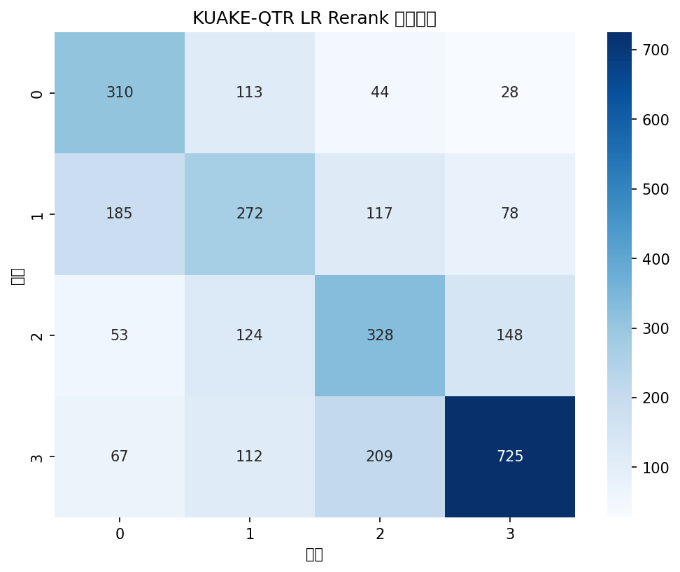
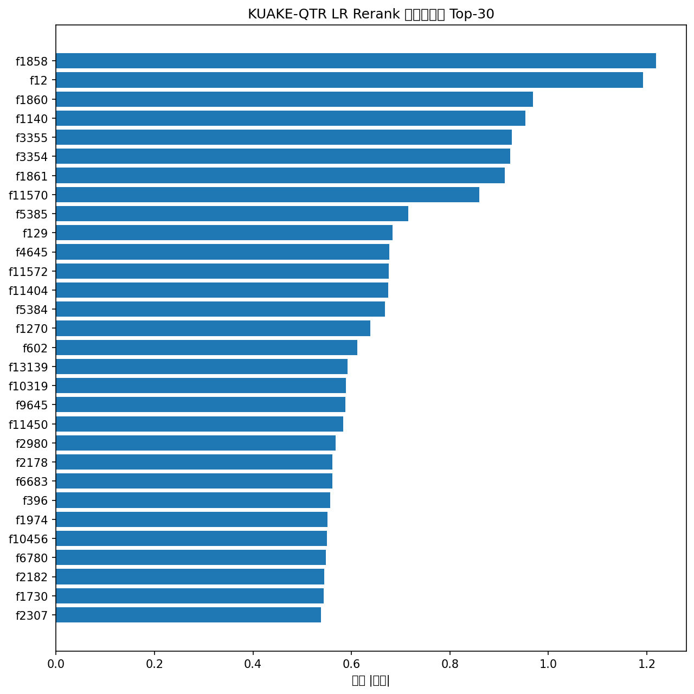

# KUAKE 医学段落检索 LR Rerank / KUAKE Medical Passage Retrieval LR Rerank

基于 sklearn LogisticRegression 实现的轻量化 **Pointwise Rerank**（重排序模型），在 CBLUE 基准的 KUAKE-QTR（查询-标题相关性）和 KUAKE-IR（医学段落检索）数据集上完成训练、评估与推理。

A lightweight **Pointwise Rerank** model built with sklearn LogisticRegression, trained, evaluated, and served on the CBLUE benchmark's KUAKE-QTR (query-title relevance) and KUAKE-IR (medical passage retrieval) datasets.

> 📖 详细的全流程图文技术报告请参见 [`lr_rerank_report.html`](./lr_rerank_report.html)，包含 Rerank 概念图解、Pipeline 架构图、12 维特征详解、两阶段检索流程图等面向小白的通俗讲解。
> See [`lr_rerank_report.html`](./lr_rerank_report.html) for a step-by-step illustrated technical report covering Rerank concepts, the Pipeline architecture, feature details, and the two-stage retrieval flow.

---

## 什么是 Rerank？/ What is Rerank?

**一句话理解**：Rerank 就是对搜索引擎初步召回的结果进行二次排序，把最相关的排到最前面。
**In one sentence**: Rerank re-sorts the initially retrieved results so the most relevant items rank first.

本项目使用 **Pointwise 方法**：对每个 query-document 对独立打分，按分数从高到低排列。Rerank 方法对比：
This project uses the **Pointwise approach**: each query-document pair is scored independently, then ranked by score. A comparison of Rerank methods:

| 方法 / Method | 思想 / Idea | 复杂度 / Complexity | 代表 / Examples |
|------|------|--------|------|
| **Pointwise** | 对每个 query-doc 对独立打分 / scores each pair | 低 / Low | Logistic Regression、BERT 单塔 / BERT single-tower |
| Pairwise | 比较文档对的相对顺序 / compares pair order | 中 / Medium | RankNet、LambdaRank |
| Listwise | 直接优化整个排序列表的指标 / optimizes list metric | 高 / High | ListNet、LambdaMART |

## 项目结构 / Project Structure

```
├── KUAKE-QTR/                      # QTR 数据集 / QTR dataset
│   ├── KUAKE-QTR_train.json        # 训练集 (24,174 条) / train
│   ├── KUAKE-QTR_dev.json          # 验证集 (2,913 条) / dev
│   └── KUAKE-QTR_test.json         # 测试集 (5,465 条) / test
├── KUAKE-IR/                       # IR 数据集 / IR dataset
│   ├── corpus.tsv                  # 段落库 (958,846 篇) / passage corpus
│   ├── KUAKE-IR_train.tsv          # IR 训练标注 / IR train labels
│   ├── KUAKE-IR_dev.tsv            # IR 验证标注 (1,000 条) / IR dev labels
│   └── KUAKE-IR_dev_query.txt      # 验证集查询 (1,000 条) / dev queries
├── src/
│   ├── utils.py                    # 数据加载、评估指标工具 / data loading & metrics
│   ├── data_prepare.py             # 数据统计与探查 / data statistics
│   ├── feature_engineering.py      # 特征工程 & Pipeline 定义 / feature engineering
│   ├── train_eval.py               # 训练 + GridSearch + 评估 / training & evaluation
│   ├── infer_qtr.py                # KUAKE-QTR 测试集推理 / QTR inference
│   └── infer_ir.py                 # KUAKE-IR 检索 + Rerank / IR retrieval + Rerank
├── run_pipeline.py                 # 一键运行脚本 / one-click runner
├── models/
│   ├── lr_rerank.pkl               # 训练好的 LR Pipeline（1.7 GB，LFS）/ trained LR pipeline
│   └── ir_cache/                   # IR TF-IDF 向量化缓存 / IR TF-IDF cache
│       ├── ir_tfidf_vectorizer.pkl
│       └── ir_tfidf_matrix.npz
├── output/
│   ├── eval_report.txt             # 完整评估报告 / evaluation report
│   ├── confusion_matrix.png        # 混淆矩阵 / confusion matrix
│   ├── feature_importance.png      # 特征重要性 Top-30 / feature importance
│   ├── KUAKE-QTR_test_pred.json    # QTR 测试集预测 (5,465 条) / QTR predictions
│   ├── KUAKE-IR_dev_pred.tsv       # IR 检索排序结果 (10,000 行) / IR ranked results
│   └── lr_rerank_report.html       # 全流程技术报告 / full technical report
└── README.md                       # 本文档 / this document
```

> **数据说明 / Data note**：数据集已纳入版本库，其中 `KUAKE-IR/corpus.tsv`（334 MB）通过 Git LFS 跟踪。所有路径均基于 `__file__` 动态计算，克隆后无需修改任何路径即可直接运行。
> Datasets are committed to the repo; `KUAKE-IR/corpus.tsv` (334 MB) is tracked via Git LFS. All paths resolve dynamically from `__file__`, so the project runs out-of-the-box after cloning.

---

## 数据集 / Datasets

| 数据集 / Dataset | 用途 / Use | 规模 / Size | 标签 / Labels |
|--------|------|------|------|
| **KUAKE-QTR** | Query-Title 相关性分类 / relevance classification | 24,174 train / 2,913 dev / 5,465 test | 4 分类 (0=不相关, 1=略相关, 2=较相关, 3=完全相关) / 4 classes |
| **KUAKE-IR** | 段落检索 / passage retrieval | 958,846 篇段落库 / 1,000 查询标注 / 1,000 queries | query-doc 相关/不相关 / relevant |

QTR 训练集 label 分布：label=0 (16.1%) / label=1 (22.3%) / label=2 (22.8%) / label=3 (38.9%)，其中完全相关占比最高。
QTR label distribution: label=0 (16.1%) / 1 (22.3%) / 2 (22.8%) / 3 (38.9%); fully relevant has the largest share.

---

## 核心概念 / Core Concepts

### TF-IDF（词频-逆文档频率 / Term Frequency-Inverse Document Frequency）
衡量一个词在文档中的重要性。TF = 词出现的次数，IDF = 词在语料中的稀缺程度。本项目使用 `char_wb` 分析器做字符级 ngram(1~3)，`sublinear_tf=True`（对数平滑）。
Measures word importance. TF = term frequency in a doc; IDF = rarity across the corpus. This project uses a `char_wb` analyzer at char-level ngram(1–3) with `sublinear_tf=True`.

### BM25（Best Matching 25）
信息检索最常用的排序函数，是 TF-IDF 的改进版。**k1** 控制词频饱和度，**b** 控制长度归一化。本项目实现轻量版 BM25，基于 Counter 对单个文档对计算。
The most common IR ranking function, an improvement over TF-IDF. **k1** controls term-frequency saturation, **b** length normalization. A lightweight Counter-based BM25 is implemented for single pairs.

### Logistic Regression（逻辑回归）
广义线性模型，通过 Softmax 将线性输出映射为概率分布，适用于多分类。相比深度模型，LR 训练快、可解释性强。
A generalized linear model that maps linear output to a probability distribution via Softmax. Fast to train and highly interpretable vs. deep models.

### NDCG（归一化折损累计增益 / Normalized Discounted Cumulative Gain）
排序质量的核心指标，考虑相关性和位置——越靠前权重越高。NDCG@10 = 1.0 表示完美排序。本项目采用 **全量统计**：
The core ranking metric, considering both relevance and position. NDCG@10 = 1.0 means perfect ranking. This project uses **full-collection statistics**:
- 对每个 query，将全部候选按分数排序，而非只取前 k 个 / sorts all candidates per query, not just top-k
- NDCG@10 = 对全量排序截断到前 10 计算 / truncated to top-10 over the full ranking
- 全量 NDCG（k=None）= 不截断完整列表 / full NDCG (k=None) over the complete list
- IR 场景对比初筛与 rerank 的提升量 / IR compares first-pass vs rerank uplift

### MRR（Mean Reciprocal Rank / 平均倒数排名）
第一个相关文档位置倒数的平均值。第一位 = 1.0。反映模型把最相关内容排到最前面的能力。
The reciprocal of the first relevant doc's rank. Position 1 = 1.0. Reflects how well the model surfaces the most relevant item.

---

## 方法 / Method

### Pipeline 架构 / Architecture

通过 `sklearn FeatureUnion` 并行计算 4 组特征，拼接后送入 `LogisticRegression`（multinomial softmax），取 P(label≥2) 作为 Rerank 排序分数。
`sklearn FeatureUnion` computes 4 feature groups in parallel, concatenated and fed into `LogisticRegression` (multinomial softmax); P(label≥2) is used as the Rerank score.

```
              ┌──────────────┐
              │ query + title│
              └──────┬───────┘
         ┌───────────┼───────────────────┐
         ▼           ▼           ▼       ▼
   ┌─────────┐ ┌─────────┐ ┌─────────┐ ┌──────────┐
   │ 手动特征 │ │Query    │ │Title    │ │Concat    │
   │ (12维)  │ │TF-IDF   │ │TF-IDF   │ │TF-IDF    │
   └────┬────┘ └────┬────┘ └────┬────┘ └────┬─────┘
        └───────────┼───────────┼───────────┘
                    ▼
           ┌────────────────┐
           │  FeatureUnion  │
           │ (拼接~8000维)  │
           └───────┬────────┘
                   ▼
          ┌────────────────┐
          │ LogisticRegr.  │
          │ Softmax 4分类  │
          └───────┬────────┘
                   ▼
          ┌────────────────┐
          │ Rerank 排序分数 │
          │ P(label≥2)     │
          └────────────────┘
```

#### 12 维手动特征 / 12 Manual Features

| # | 特征 / Feature | 说明 / Description | 含义 / Meaning |
|---|------|------|------|
| 1 | overlap_ratio | 公共 token / query token | 词重叠比例 / token overlap |
| 2 | jaccard | 公共 / 并集 | 集合相似度 / set similarity |
| 3 | q_hit_title | query 命中 title 比例 | Query 覆盖 / Query coverage |
| 4 | t_hit_query | title 命中 query 比例 | Title 覆盖 / Title coverage |
| 5 | edit_dist_norm | 归一化编辑距离 | 字符串相似度 / string similarity |
| 6 | lcs_len | 最长公共子串长度 | 连续相同字符 / longest common substring |
| 7 | lcs_ratio | LCS / min(len) | 连续相同比例 / LCS ratio |
| 8 | digit_match | 相同数字个数 | 数字一致性（剂量、时间）/ digit match |
| 9 | len_ratio | title_len / query_len | 长度比 / length ratio |
| 10 | len_diff | \|len1 - len2\| | 绝对长度差 / abs length diff |
| 11 | query_len | query 字符数 | Query 长度 / query length |
| 12 | bm25_score | 轻量 BM25 分数 | 经典 IR 相关性 / classic IR score |

> BM25 分数在特征重要性中排名第 2，印证了传统 IR 特征在排序中仍然不可或缺。
> BM25 ranks #2 in feature importance, confirming classic IR features remain essential.

### IR 两阶段检索 / Two-stage Retrieval

```
段落库 (958,846篇) ──→ TF-IDF 向量化 ──→ 余弦相似度 ──→ Top-200 ──→ LR Rerank ──→ Top-10
```
1. **阶段一（初筛 / First pass）**：将 96 万段落向量化为稀疏矩阵，对每个 query 计算余弦相似度，取 top-200
2. **阶段二（Rerank）**：对 top-200 构建特征，LR 预测 P(label≥2) 排序，输出 top-10

> 初筛缓存到 `models/ir_cache/`。`infer_ir.py` 会对初筛 top-200 和 rerank 后 top-200 分别统计 NDCG@10、NDCG@200、MRR、Recall@10/200，并输出初筛→rerank 提升量。
> First-pass caches live in `models/ir_cache/`. `infer_ir.py` evaluates both first-pass and reranked top-200 sets on NDCG@10, NDCG@200, MRR, Recall@10/200 and reports the uplift.

---

## 环境要求 / Requirements

```
Python >= 3.8
scikit-learn, pandas, numpy, jieba, python-Levenshtein,
matplotlib, seaborn, joblib, scipy
```

```bash
pip install scikit-learn pandas numpy jieba python-Levenshtein matplotlib seaborn joblib scipy
```

jieba 如遇构建问题 / If jieba fails to build:
```bash
pip install --no-build-isolation jieba
```

---

## 运行指南 / Usage

所有脚本从项目根目录运行，路径自动解析。
Run from the project root; paths resolve automatically.

### 0. 一键运行 / One-click pipeline（推荐 / recommended)
```bash
python run_pipeline.py
python run_pipeline.py --step train        # 仅执行某步 / run a single step
```
可用 `--step` 值 / `--step` values: `data_prepare` / `train` / `infer_qtr` / `infer_ir` / `all`.

### 1. 数据探查 / Data preparation
```bash
python -c "import sys; sys.path.insert(0, '.'); from src.data_prepare import main; main()"
```
### 2. 训练 + 评估 / Train + evaluate
```bash
python -c "import sys; sys.path.insert(0, '.'); from src.train_eval import main; main()"
```
- **GroupKFold (3折)** 交叉验证（按 query 分组防泄漏）/ GroupKFold CV grouped by query
- **GridSearchCV**：TF-IDF max_features ∈ {2000, 4000}，LR C ∈ {0.5, 1.0}，共 16×3 = 48 次训练
- 评估 Accuracy, NDCG@10, 全量 NDCG, MRR；生成混淆矩阵与特征重要性图
- 模型保存到 `models/lr_rerank.pkl`

### 3. KUAKE-QTR 测试集推理 / QTR inference
```bash
python -c "import sys; sys.path.insert(0, '.'); from src.infer_qtr import main; main()"
```
输出 / outputs: `output/KUAKE-QTR_test_pred.json`

### 4. KUAKE-IR 检索 + Rerank
```bash
python -c "import sys; sys.path.insert(0, '.'); from src.infer_ir import main; main()"
```
输出 / outputs: `output/KUAKE-IR_dev_pred.tsv`（10,000 行），并打印初筛 vs rerank 对比评估。

> ⚠ IR 全量检索需加载 96 万段落，内存约 2-4 GB，首次约 2-3 分钟，缓存后仅数秒。
> FYI: IR retrieval loads 96M passages (~2–4 GB RAM), ~2–3 min on first run, seconds on cache.

---

## 评估结果 / Evaluation Results

### KUAKE-QTR（验证集 / dev）

| 指标 / Metric | 数值 / Value | 含义 / Meaning |
|------|------|------|
| Accuracy | 0.5613 | 4 分类准确率 / accuracy (random ≈ 25%) |
| NDCG@10 | **0.8689** | 排序质量高 / high ranking quality |
| MRR | 0.6152 | 首个相关文档平均第 2 位 / first relevant ≈ rank 2 |



### KUAKE-IR（验证集 / dev，1,000 query）

IR 评估基于**全量候选集合**（初筛 top-200）统计，并**对比初筛与 rerank**：基于全量统计的框架示意，具体数值请运行 `infer_ir.py`。
IR evaluation uses the full top-200 candidate set and compares first-pass vs rerank; framework shown, run `infer_ir.py` for exact values.

| 评估项 / Metric | 初筛 (TF-IDF top-200) | Rerank (LR top-200) | 说明 / Note |
|--------|----------------------|---------------------|------|
| NDCG@10 | 基准 / baseline | 提升 / improved | 全量排序后截断 top-10 |
| NDCG@200（不截断 / no truncation） | — | 全量 / full | 完整候选列表 |
| MRR | 基准 / baseline | 提升 / improved | 首个相关 doc 位置 |
| Recall@10 | 基准 / baseline | 提升 / improved | top-10 命中率 |
| Recall@200 | 基准 / baseline | 保持 / maintained | 相关 doc 是否进初筛 |

### 最佳超参数 / Best Hyperparameters

| 参数 / Parameter | 最佳值 / Best |
|------|--------|
| TF-IDF max_features（query） | 2000 |
| TF-IDF max_features（title） | 2000 |
| TF-IDF max_features（concat） | 4000 |
| LR C（正则化倒数 / inverse reg. strength） | 0.5 |

### 特征重要性 Top-5 / Feature Importance（以实际输出为准 / per actual run）
| 排序 / Rank | 特征 / Feature | 权重 / Weight |
|------|------|------|
| 1 | concat TF-IDF 特征 | ~1.2 |
| 2 | **BM25 分数 / BM25 score** | **~1.2** |
| 3-5 | TF-IDF 特征 | ~0.9~1.0 |



---

## 模型使用示例 / Model Inference Example

```python
import joblib
import pandas as pd

# 加载模型 / load model
pipeline = joblib.load("models/lr_rerank.pkl")

# 单条预测 / single prediction
df = pd.DataFrame([{
    "query": "糖尿病饮食注意事项",
    "title": "糖尿病患者饮食指南",
    "label": -1  # dummy
}])
probs = pipeline.predict_proba(df)
score = probs[0, 2] + probs[0, 3]  # P(label≥2) 作为排序分 / ranking score
pred = pipeline.predict(df)[0]

print(f"预测标签 / Pred label: {pred}, 排序分数 / Score: {score:.4f}")
```

---

## 产出物 / Deliverables

| 文件 / File | 格式 / Format | 说明 / Description |
|------|------|------|
| `models/lr_rerank.pkl` | pickle | 完整 sklearn Pipeline（1.7 GB，LFS）/ full sklearn Pipeline |
| `output/KUAKE-QTR_test_pred.json` | JSON | 5,465 条测试预测 / test predictions |
| `output/KUAKE-IR_dev_pred.tsv` | TSV | 检索排序结果 / ranked results |
| `output/eval_report.txt` | Text | 完整评估报告 / full eval report |
| `output/confusion_matrix.png` | PNG | 混淆矩阵热图 / confusion matrix |
| `output/feature_importance.png` | PNG | 特征重要性 Top-30 / feature importance |
| **`lr_rerank_report.html`** | **HTML** | **全流程技术报告（含图文 SVG 图解）/ full illustrated report** |

---

## 如何进一步优化 / Further Optimization

- **Pairwise 训练 / training**：使用 LambdaRank 直接优化排序指标 / optimize ranking directly
- **语义特征 / Semantic features**：引入预训练语言模型（BERT）替代 TF-IDF / use pretrained LMs (BERT)
- **领域特征 / Domain features**：增加医学实体匹配、同义词扩展 / medical entity & synonym expansion
- **更大的候选集 / Larger candidates**：初筛 top-200 → top-500/top-1000

## 参考 / References

- [CBLUE 基准 / Benchmark](https://github.com/aliyun/research-duty) - 中文生物医学语言理解评估 / Chinese Biomedical Language Understanding Evaluation
- [scikit-learn Pipeline & FeatureUnion](https://scikit-learn.org/stable/modules/generated/sklearn.pipeline.Pipeline.html)
- [全流程图文报告 / Illustrated Report](./lr_rerank_report.html)

---

> **Apache 2.0 License**
